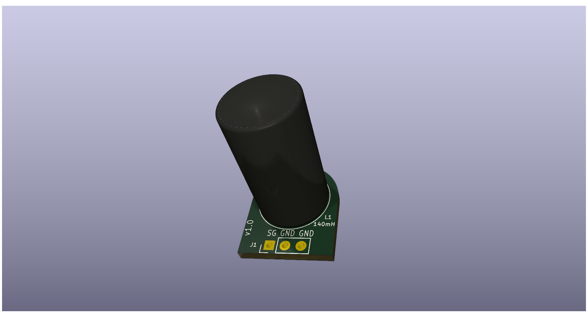
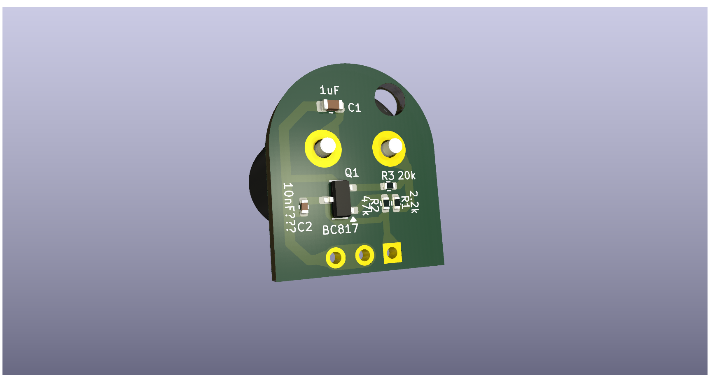

# Worx-Landroid-Front-Sensor-pcb
i have tried to replicate Worx Landroid W790.E &amp; W791.E front sensors.

# Bill of Materials (BOM)

# Bill of Materials (BOM)

|Reference|Component Type|Value|Unit|Package|Quantity|
|---------|--------------|-----|----|-------|--------|
|L1       |Inductor      |180  |mH  |TBD    |1       |
|R1       |Resistor      |2.2  |kΩ  |0402   |1       |
|R2       |Resistor      |20   |kΩ  |0402   |1       |
|R3       |Resistor      |47   |kΩ  |0402   |1       |
|C1       |Capacitor     |1    |µF  |0603   |1       |
|C2       |Capacitor     |10   |nF  |0402   |1       |

-----

**Total Components:** 6  
**Component Types:** 3 (Inductor: 1, Resistors: 3, Capacitors: 2)

**Total Components:** 6  
**Component Types:** 3 (Inductor: 1, Resistors: 3, Capacitors: 2)

